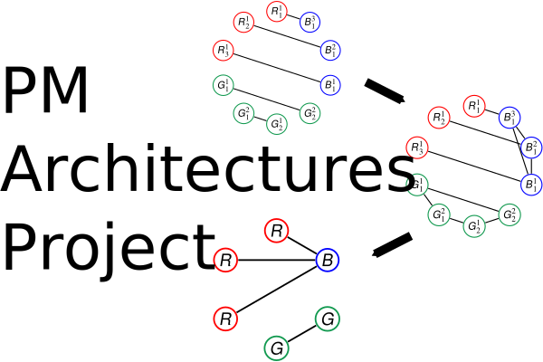

## README (pm-architectures-project)

[](https://github.com/danielrherber/pm-architectures-project/releases/latest)
[](https://github.com/danielrherber/pm-architectures-project/blob/master/License)
[](https://zenodo.org/badge/latestdoi/66202983)

[](https://www.mathworks.com/products/matlab.html)
[](https://github.com/danielrherber/pm-architectures-project/issues)
[](https://github.com/danielrherber/pm-architectures-project/graphs/contributors)
[](https://gitter.im/pm-architectures-project/community)

Generate the set of unique useful graphs with a perfect matching-based approach.



---
### Install
* Download the [project files](https://github.com/danielrherber/pm-architectures-project/archive/master.zip) and extract the .zip to a writable location
* Run [INSTALL_PMA_project.m](INSTALL_PMA_project.m) in the MATLAB Command Window until no errors are seen
(*automatically adds project files to your MATLAB path, downloads the required files, checks your Python setup, and opens some examples*)

```matlab
INSTALL_PMA_project
```
* See [PMA_EX_A001187.m](examples/oeis/PMA_EX_A001187.m) and [PMA_EX_MD161635_CS1.m](examples/md161635/PMA_EX_MD161635_CS1.m) for some starting examples with problem setup and options
```matlab
open PMA_EX_A001187
open PMA_EX_MD161635_CS1
```
* See the [examples](examples/) folder for more ways to use this project (including many [OEIS](examples/oeis/) examples and system architecture [patterns](examples/patterns/))

### Citation
Many elements of this project are discussed in the following papers. Please cite them if you use the project.

* DR Herber. **Enhancements to the perfect matching approach for graph enumeration-based engineering challenges**. In ASME 2020 International Design Engineering Technical Conferences, DETC2020-22774, Aug. 2020. [[DOI]](https://doi.org/10.1115/DETC2020-22774) [[PDF]](https://www.engr.colostate.edu/%7Edrherber/files/Herber2020b.pdf)
	- *Shortened Abstract: Improved methods for effectively representing and generating all graphs in a space defined by certain complex specifications are presented. These improvements are realized through enhancements to the original perfect matching-inspired approach utilizing a component catalog definition to capture the graphs of interest. These enhancements will come in many forms, including more efficient graph enumeration and labeled graph isomorphism checking, expansion of the definition of the component catalog, and the effective inclusion of new network structure constraints. Several examples are shown, including improvements to the original case studies (with up to 971x reduction in computational cost) as well as graph problems in common system architecture design patterns.*
* DR Herber, T Guo, JT Allison. **Enumeration of architectures with perfect matchings**. Journal of Mechanical Design, 139(5), p. 051403, May 2017. [[DOI]](https://doi.org/10.1115/1.4036132) [[PDF]](https://www.engr.colostate.edu/%7Edrherber/files/Herber2017a.pdf)
	- *Shortened Abstract: A class of architecture design problems is explored with perfect matchings (PMs). A perfect matching in a graph is a set of edges such that every vertex is present in exactly one edge. The perfect matching approach has many desirable properties such as complete design space coverage. Improving on the pure perfect matching approach, a tree search algorithm is developed that more efficiently covers the same design space. The effect of specific network structure constraints (NSCs) and labeled graph isomorphisms on the desired design space is demonstrated. This is accomplished by determining all unique feasible graphs for a select number of architecture problems, explicitly demonstrating the specific challenges of architecture design. With this methodology, it is possible to enumerate all possible architectures for moderate scale-systems.*
* DR Herber, JT Allison. **Enhancements to the perfect matching-based tree algorithm for generating architectures**. Technical report, Engineering System Design Lab, UIUC-ESDL-2017-02, Urbana, IL, USA, Dec. 2017. [[URL]](http://hdl.handle.net/2142/98990) [[PDF]](https://www.engr.colostate.edu/%7Edrherber/files/Herber2017d.pdf)
	- *Older technical report that is generally superseded by the recent IDETC 2020 paper above. It does contain additional illustrations of some of the enhancements.*

This project has been used in the following papers to solve various engineering architecture design problems.

* DR Herber. **Advances in combined architecture, plant, and control design.** PhD Dissertation, University of Illinois at Urbana-Champaign, Urbana, IL, USA, Dec. 2017. [[URL]](http://hdl.handle.net/2142/99394) [[PDF]](https://www.engr.colostate.edu/%7Edrherber/files/Herber2017e.pdf#page=162)
	- *Synthesis of passive analog circuits*
* DR Herber, JT Allison. **A problem class with combined architecture, plant, and control design applied to vehicle suspensions.** Journal of Mechanical Design, 141(10), p. 101401, Oct. 2019. [[DOI]](https://doi.org/10.1115/1.4043312) [[PDF]](https://www.engr.colostate.edu/%7Edrherber/files/Herber2019b.pdf)
	- *Synthesis of active vehicle suspensions*
* DR Herber, JT Allison, R Buettner, P Abolmoali, SS Patnaik. **Architecture generation and performance evaluation of aircraft thermal management systems through graph-based techniques.** In AIAA 2020 Science and Technology Forum and Exposition, AIAA 2020-0159, Orlando, FL, USA, Jan 2020. [[DOI]](https://doi.org/10.2514/6.2020-0159) [[PDF]](https://www.engr.colostate.edu/%7Edrherber/files/Herber2020a.pdf)
	- *Subgraph enumeration of aircraft thermal management systems*
* T Guo, DR Herber, JT Allison. **Reducing evaluation cost for circuit synthesis using active learning.** In ASME 2018 International Design Engineering Technical Conferences, DETC2018-85654,Quebec City, Canada, Aug. 2018. [[DOI]](https://doi.org/10.1115/DETC2018-85654) [[PDF]](https://www.engr.colostate.edu/%7Edrherber/files/Guo2018a.pdf)
	- *Circuit design data for machine learning generated using this project*
* T Guo, DR Herber, JT Allison. **Circuit synthesis using generative adversarial networks (GANs)**. In AIAA 2019 Science and Technology Forum and Exposition, AIAA 2019-2350, San Diego, CA, USA, Jan. 2019. [[DOI]](https://doi.org/10.2514/6.2019-2350) [[PDF]](https://www.engr.colostate.edu/%7Edrherber/files/Guo2019a.pdf)
	- *Circuit design data for machine learning generated using this project*

### External Includes
* See [INSTALL_PMA_project.m](INSTALL_PMA_project.m) for more information
* **MATLAB File Exchange Submissions** ([10922](https://www.mathworks.com/matlabcentral/fileexchange/10922), [23629](https://www.mathworks.com/matlabcentral/fileexchange/23629), [29438](https://www.mathworks.com/matlabcentral/fileexchange/29438), [40397](https://www.mathworks.com/matlabcentral/fileexchange/40397), [47246](https://www.mathworks.com/matlabcentral/fileexchange/47246),  [52301](https://www.mathworks.com/matlabcentral/fileexchange/52301), [68575](https://www.mathworks.com/matlabcentral/fileexchange/68575))
* **Python** ([Python 3.8](https://www.python.org/), [numpy](https://numpy.org/), [igraph](https://igraph.org/python/), [networkx](https://networkx.github.io/)), *optional depending on graph isomorphism checking option*

---
### General Information

#### Contributors
* [Daniel R. Herber](https://github.com/danielrherber) (primary)
* [Tinghao Guo](https://github.com/TinghaoGuo)
* [James T. Allison](https://github.com/jamestallison)
* [Shangting Li](https://github.com/shangtingli)

#### Project Links
* [https://github.com/danielrherber/pm-architectures-project](https://github.com/danielrherber/pm-architectures-project)
* [https://www.mathworks.com/matlabcentral/fileexchange/58799](https://www.mathworks.com/matlabcentral/fileexchange/58799)